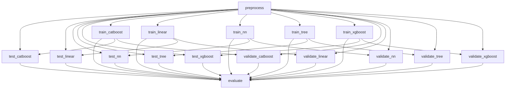

```mermaid
flowchart TD
	node1["evaluate"]
	node2["preprocess"]
	node3["test_catboost"]
	node4["test_linear"]
	node5["test_nn"]
	node6["test_tree"]
	node7["test_xgboost"]
	node8["train_catboost"]
	node9["train_linear"]
	node10["train_nn"]
	node11["train_tree"]
	node12["train_xgboost"]
	node13["validate_catboost"]
	node14["validate_linear"]
	node15["validate_nn"]
	node16["validate_tree"]
	node17["validate_xgboost"]
	node2-->node3
	node2-->node4
	node2-->node5
	node2-->node6
	node2-->node7
	node2-->node8
	node2-->node9
	node2-->node10
	node2-->node11
	node2-->node12
	node2-->node13
	node2-->node14
	node2-->node15
	node2-->node16
	node2-->node17
	node3-->node1
	node4-->node1
	node5-->node1
	node6-->node1
	node7-->node1
	node8-->node1
	node8-->node3
	node8-->node13
	node9-->node1
	node9-->node4
	node9-->node14
	node10-->node1
	node10-->node5
	node10-->node15
	node11-->node1
	node11-->node6
	node11-->node16
	node12-->node1
	node12-->node7
	node12-->node17
	node13-->node1
	node14-->node1
	node15-->node1
	node16-->node1
	node17-->node1
```