# Лабораторные работы 1-2
Методы искусственного интеллекта. EDA. Линейная регрессия. Дерево решений. CatBoost. XGBoost. Нейронные сети (MLP).
---
# Цель работы

Цель данной работы заключается в получении навыков анализа первичных данных и определение признаков взаимосвязи (EDA), понимания моделей: линейная регрессия, дерево решений, CatBoost, XGBoost, нейронные сети (MLP) и умения разрабатывать программу на языке Python для реализации представленных моделей.

# Задачи
1. Провести разведочный анализ данных (EDA) – определить влияние признаков, выбрать наиболее значимые для предсказания.
2. Построить пайплайн обработки и обучения с использованием DVC.
3. Реализовать линейную регрессию, вычислить веса, метрики и ошибки.
4. Реализовать дерево решений, вычислить метрики, ошибки, визуализировать первые узлы.
5. Реализовать CatBoost – метрики, ошибки, выгрузить важность признаков.
6. Реализовать XGBoost – метрики, ошибки, выгрузить важность признаков.
7. Реализовать нейронную сеть (MLP) – метрики, ошибки, кривые обучения, гистограммы весов, график TensorBoard.
8. Выгрузить итоговый вычислительный граф DVC.
9. Построить сводную таблицу метрик и сделать вывод о лучшей модели.
10. Сформулировать общий вывод по работе.

## Оглавление

1. [Цель работы](#-цель-работы)
2. [Подготовка датасета](#-подготовка-датасета)
3. [Тепловые карты и EDA](#-тепловые-карты-и-eda)
4. [Построение моделей](#-построение-моделей)
   - [Линейная регрессия](#1-линейная-регрессия)
   - [Дерево решений](#2-дерево-решений)
   - [CatBoost](#3-catboost)
   - [XGBoost](#4-xgboost)
   - [Нейронная сеть (MLP)](#5-нейронная-сеть-mlp)
5. [Настройка и контроль гиперпараметров](#-настройка-и-контроль-гиперпараметров)
6. [Результаты работы](#-результаты-работы)
7. [Выводы](#-выводы)
8. [Запуск проекта](#-запуск-проекта)

---
## Анализ данных

В качестве задания стоит предсказание цены подержанного автомобиля в зависимости от различных параметров: пробег, год выпуска, тип топлива, тип коробки передач, количество владельцев, а также такие характеристики как расход топлива, объём и мощность двигателя.

**Целевая переменная: `price` (цена продажи автомобиля).
---

## Подготовка датасета

Источники данных

Данные были получены из трёх источников и объединены в единый датасет:

| Исходные файлы таблиц | Строк | Столбцов |
|------|-------|----------|
| `car_data.csv` | ~300 | 9 | 
| `CAR_DETAILS_FROM_CAR_DEKHO.csv` | ~4000 | 8 |
| `Car_details_v3.csv` | ~7500 | 15 |

После унификации столбцов и объединения таблиц был перечень признаков

Общая сумма строк составила ~11 800 

 Перечень признаков: 
---
|№|	Признак|Тип|Описание|Источник|
|-|--------|---|--------|--------|
|1|	name|	Категориальный (строковый)|	Название модели автомобиля|	Все файлы|
|2|	year|	Числовой (int)|	Год выпуска автомобиля|	Все файлы|
|3|	price|	Числовой (float)|	Целевая переменная — цена продажи |	Все файлы|
|4|	km_driven|	Числовой (int)|	Пробег автомобиля в километрах|	Все файлы|
|5|	fuel|	Категориальный (строковый)|	Тип топлива: Petrol, Diesel, CNG, LPG, Electric|	Все файлы|
|6|	seller_type|	Категориальный (строковый)|	Тип продавца: Individual (частник), Dealer (дилер)|	Все файлы|
|7|	transmission|	Категориальный (строковый)|	Тип КПП: Manual, Automatic|	Все файлы|
|8|	owner|	Категориальный (строковый/числовой)|	Количество владельцев: First, Second, Third, Fourth & Above|	Все файлы|
|9|	mileage|	Строковый|	Расход топлива|	Только Car_details_v3.csv|
|10|	engine|	Строковый|	Объём двигателя| Только Car_details_v3.csv|
|11|	max_power|	Строковый|	Мощность двигателя|	Только Car_details_v3.csv|
|12|	torque|	Строковый|	Крутящий момент| Только Car_details_v3.csv|
|13|	seats|	Числовой (int)|	Количество посадочных мест|	Только Car_details_v3.csv|
|14|	present_price|	Числовой (float)|	Изначальная цена автомобиля в салоне|	Только car_data.csv|
|15|	car_age|	Числовой (int)|	Возраст автомобиля в годах|	2026 - year|
|16|	owner_encoded|	Числовой (int)|	Кодированное количество владельцев|	First Owner→1, Second→2, Third→3, Fourth→4, Test Drive→0|
|17|	mileage_num|	Числовой (float)|	Расход топлива (числовое значение)|	Извлечено из mileage|
|18|	engine_num|	Числовой (float)|	Объём двигателя в куб. см|	Извлечено из engine|
|19|	max_power_num|	Числовой (float)|	Мощность двигателя в л.с.|	Извлечено из max_power|
|20|	torque_num|	Числовой (float)|	Крутящий момент в Н·м|	Извлечено из torque|
|21|	brand|	Категориальный (строковый)|	Извлечённый бренд автомобиля|	Первое слово из name|
|22|	brand_category|	Категориальный (строковый)|	Категория бренда|	premium/mass/budget/sports/other|


### Предобработка данных

В ходе предобработки были выполнены следующие действия:

1.  Созданы новые признаки**:
   - `car_age` = 2026 - `year` (возраст автомобиля)
   - `brand_category` — категория бренда (premium/mass/budget/sports/other)

2. **Пропуски в богатых признаках заполнены методом KNN Imputer**

3. **Удалены столбцы, не поддающиеся корректной интерпретации** — `name` (слишком много уникальных значений), `year` (заменён на `car_age`)

4. **Преобразованы признаки**:
   - `fuel`, `seller_type`, `transmission`, `brand_category` — One-Hot кодирование
   - Числовые признаки — StandardScaler

5. **Целевая переменная** преобразована с помощью `sqrt` для уменьшения асимметрии

### Категории брендов
---
|Категория|	Описание|	Примеры брендов|
|-|-|-|
|premium|	Премиальные автомобили|	BMW, Mercedes-Benz, Audi, Lexus, Jaguar, Land Rover, Volvo, Porsche|
|mass|	Массовые бренды|	Maruti (Suzuki), Hyundai, Honda, Toyota, Ford, Nissan, Kia, Volkswagen, Chevrolet, Renault, Skoda|
|budget|	Бюджетные бренды|	Datsun, Tata, Mahindra, Lada
|sports| Спортивные автомобили и мотоциклы|	Royal Enfield, KTM, Yamaha, Kawasaki, Ducati, Bajaj|
|other|	Остальные / редкие бренды|	Fiat, MG, Jeep, SsangYong, Force, Daewoo|

---
## Полная тепловая карта
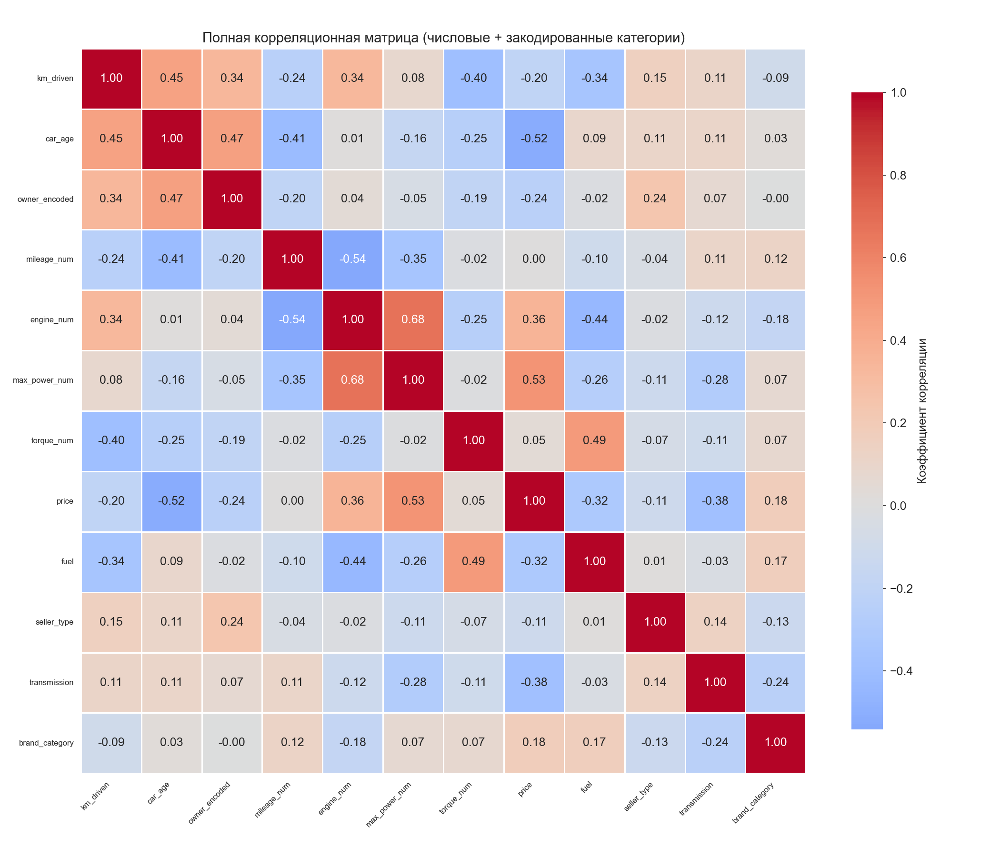

Для первичного определения зависимостей построена **тепловая карта корреляции** — удобное отображение коррелирующих между собой параметров.

## Тепловая карта и EDA


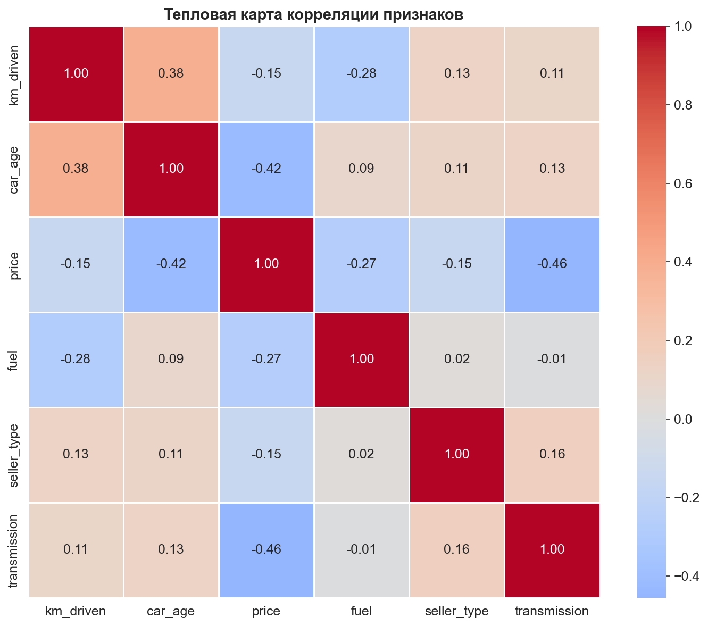

### Основные выводы по EDA

**Корреляция признаков с ценой:**

| Признак | Корреляция | Направление |
|---------|------------|-------------|
| `engine_num` | 0.36 |Положительная |
| `max_power_num` | 0.53 |Положительная |
| `car_age` | -0.52 |Отрицательная |
| `mileage_num` | -0.39 | Отрицательная |
| `transmission` | -0.38 |Отрицательная |
| `fuel`| -0.32 | Отрицательная|
| `brand_category`| 0.18 | Положительная|
| `owner_encoded` | -0.24 | Отрицательная|
| `km_driven` | -0.20 | Отрицательная|


**ВАЖНО:** между признаками могут быть нелинейные зависимости, которые на тепловой карте не отобразятся, что отразится на точности предсказания моделей.


**Средняя цена по категориям брендов:**

| Категория | Примеры | Средняя цена |
|-----------|---------|--------------|
| premium | BMW, Mercedes, Audi | 1,855,200 |
| sports | Royal Enfield, KTM | 650,800 |
| mass | Maruti, Hyundai, Honda | 450,400 |
| budget | Datsun, Tata | 280,500 |

---

## Создание DVC-пайплайна (dvc.yaml)

```bash
# Инициализация DVC в проекте
dvc init

# Добавление CSV-файла под контроль версий DVC
dvc add data/raw/car_data.csv
dvc add data/raw/Car_details_v3.csv
dvc add data/raw/CAR_DETAILS_FROM_CAR_DEKHO.csv
```
Настройка удалённого хранилища

```bash
# Добавление удалённого хранилища
dvc remote add -d storage dvc_storage

# Добавляем в Git файлы
git add .gitignore data/raw.dvc .dvc/config

# Фиксируем изменения в Git
git commit -m "Configure DVC"
```

Для работы в **Visual Studio Code** необходимо установить некоторый список расширений:
- `Python`
- `Jupyter`
- `Github` 
- `DVC extension pack`
---

### Пример содержимого dvc.yaml

```yaml
stages:
  preprocess:
    cmd: python src/data/make_dataset.py
    deps:
    - data/raw/car_data.csv
    - data/raw/CAR_DETAILS_FROM_CAR_DEKHO.csv
    - data/raw/Car_details_v3.csv
    - src/data/load_data.py
    - src/data/preprocess.py
    - src/data/make_dataset.py
    - src/features/brand_processor.py
    - src/utils/helpers.py
    - config/params.yaml
    outs:
    - data/processed/X_train.npy
    - data/processed/X_val.npy
    - data/processed/X_test.npy
    - data/processed/y_train.npy
    - data/processed/y_val.npy
    - data/processed/y_test.npy
    - data/processed/X_train_raw.csv
    - data/processed/X_val_raw.csv
    - data/processed/X_test_raw.csv
    - models/preprocessor.pkl
    - models/feature_names.txt

  train_linear:
    cmd: python src/models/train/train_linear.py
    deps:
    - data/processed/X_train.npy
    - data/processed/y_train.npy
    - src/models/train/train_linear.py
    - src/utils/helpers.py
    - config/params.yaml
    outs:
    - models/linear_regression.pkl
    - models/linear_coefficients.csv
    metrics:
    - reports/metrics/train/linear_regression.json
    plots:
    - reports/figures/linear_coefficients.png
```

Заполнение файла [dvc.yaml](dvc.yaml) происходит либо в результате ручного заполнения, либо через команду **`dvc stage add`**, например:

```bash
dvc stage add \
  -n preprocess \
  -d data/raw/car_data.csv \
  -d src/data/make_dataset.py \
```

Для запуска всех зависимостей в [dvc.yaml](dvc.yaml) необходимо запустить следующую команду:

```bash
dvc repro
```

Для проведения экспериментов с измененными параметрами моделей необходимо использовать команду **`dvc exp run`**, например:

```bash
dvc exp run -S config/params.yaml:models.decision_tree.max_depth=5
```

Для сохранения истории работы всех алгоритмов DVC используется следующая команда:

```bash
dvc push
```

## Построение моделей

Далее в работе сравниваются несколько моделей по предсказанию целевой переменной — цены автомобиля.

**Качество предсказаний моделей определяется по следующим метрикам:**

R² (коэффициент детерминации)

MAE (средняя абсолютная ошибка)

RMSE (корень из среднеквадратичной ошибки)

---

### 1. Линейная регрессия

**Гиперпараметры модели:**

```yaml
linear:
    fit_intercept: true
    positive: false
```

Для линейной регрессии была визуализирована диаграмма со значениями коэффициентов для каждого признака.

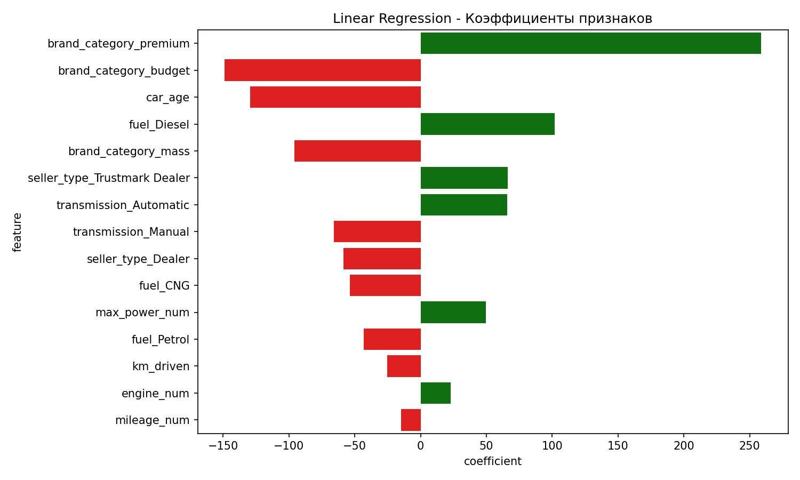

**Метрики для линейной регрессии:**


| Выборка | R² | MSE | RMSE | MAE |
|---------|----|-----|----|-----|
| train | 0.6475 |  21572.0792  |  146.87436  |  102.1105  |
| val |  0.63895 |  22258.725779  |  149.19358  |  104.37439  |
| test | 0.601117 |  24452.9665  |  156.3744  |  107.05539  |

Наибольший вклад в модель линейной регрессии вносят следующие признаки:

| Признак | Коэффициент |
|---------|-------------|
| brand_cat_premium | 258.736906 |
| brand_category_budget | -149.012684 |
| car_age | -129.471593 |
| fuel_Diesel | 101.749031 |
| brand_category_mass | -95.809561 |
| seller_type_Trustmark Dealer | 66.125713 |
| transmission_Automatic | 65.857864 |
| transmission_Manual | -65.857864 |

**Ключевые признаки:** `brand_cat_premium`, `brand_category_budget` и `car_age`. 

---

### 2. Дерево решений

**Гиперпараметры дерева решений:**
- `max_depth` — глубина, сложность дерева
- `min_samples_split` — минимальное количество объектов в узле
- `min_samples_leaf` — минимальное количество объектов в листе

**Метрики для дерева решений:**

| Выборка | R² | RMSE | MAE |
|---------|----|----|-----|
| train |  0.80387  |  12004.0115  |  109.5628  |  76.9248  |
| val |  0.75096  |  15353.16416  |  123.90788  |  85.64562  |
| test |  0.77837  |  13586.6874  |  116.56194  |  80.65466  |

**Структура первых узлов дерева решений:**

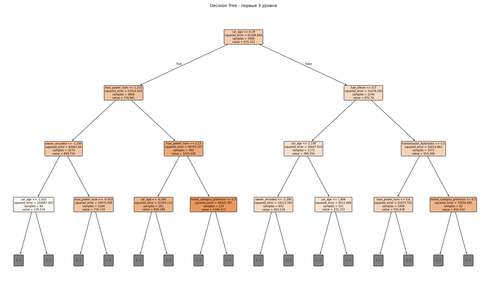

**Анализ первых узлов:**
- **Корневой узел:** разделение по `car_age <= 0.19`
  - Левая ветвь: автомобили младше на 0.19
  - Правая ветвь: автомобили старше на 0.19
- **Второй уровень:** разделение по `max_power_num` и `fuel_Diesel`

**Ключевые признаки** по результатам построения дерева решений — `car_age` и `max_power_num`

---

### 3. CatBoost

**Гиперпараметры CatBoost:**
- `iterations` — количество деревьев в ансамбле
- `learning_rate` — шаг градиентного спуска
- `depth` — глубина каждого дерева в ансамбле

**Метрики для CatBoost:**


| Выборка | R² | RMSE | MAE |
|---------|----|----|-----|
| train |  0.8247934188756694  |  10723.85938068525  |  103.5560687776687  |  74.80436857297197  |
| val |  0.7957522560504274  |  12592.02655099535  |  112.21419941787826  |  79.76242612501918  |
| test |  0.8126009258668331  |  11488.248443344693  |  107.18324702743752  |  78.0760435796817  |


**Наиболее важными признаками** оказались `max_power_num` (15.7%) и `car_age` (39.6%), так как они отражают мощность и износ автомобиля.

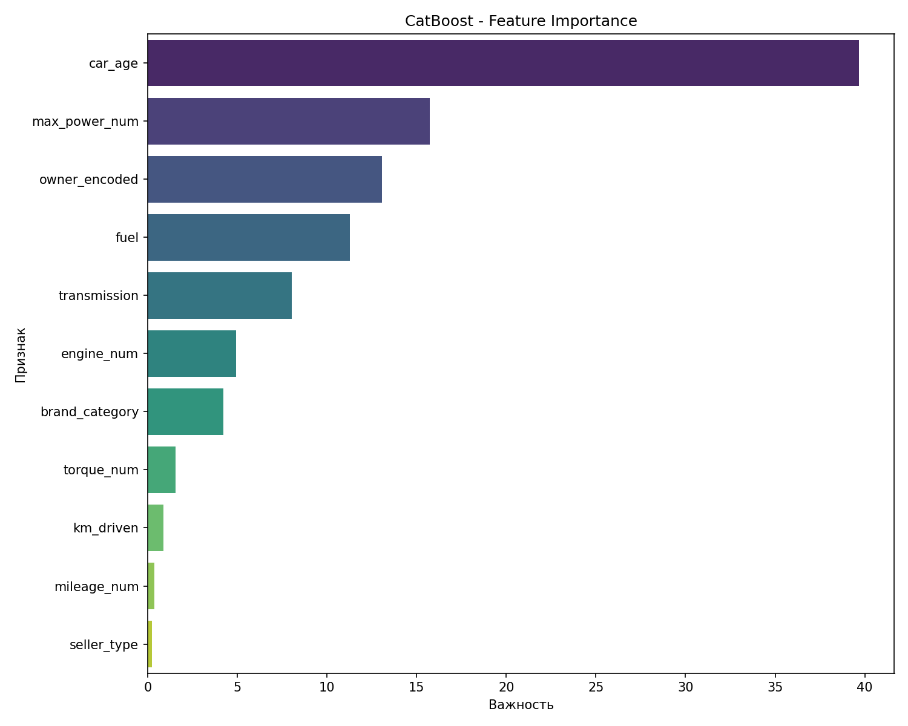

---

### 4. XGBoost

**Гиперпараметры XGBoost:**
- `n_estimators` — количество деревьев в ансамбле
- `learning_rate` — шаг градиентного спуска
- `max_depth` — глубина каждого дерева в ансамбле


**Метрики для XGBoost:**


| Выборка | R² | RMSE | MAE |
|---------|----|----|-----|
| train |  0.8747  |  7665.29117  |  87.55164 |  62.35238  |
| val |  0.81664  |  11304.10344  |  106.3207  |  73.6615  |
| test |  0.83459  |  10139.87035  |  100.6969  |  70.5658  |


**Наиболее важные признаки** — `car_age` (20.536742%) и `transmission_Automatic` (20.029846%).

| Признак | Важность |
|---------|----------|
| car_age | 20.536742% |
| transmission_Automatic | 20.029846% |
| fuel_Diesel | 16.955665% |
| owner_encoded | 13.390017% |
| max_power_num | 10.567887% |
| brand_category_mass | 4.833993% |

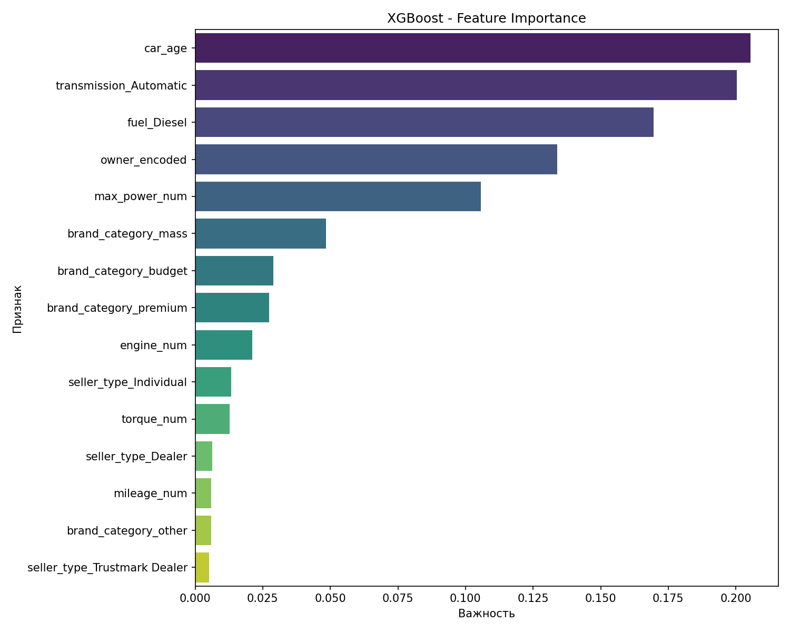

---

### 5. Нейронная сеть (MLP)

**Архитектура нейронной сети:**
Input(15) → Dense(128, ReLU) → Dropout(0.3) →
Dense(64, ReLU) → Dropout(0.2) → Dense(32, ReLU) → Dense(1)

**Гиперпараметры нейронной сети:**
- `epochs` — максимальное количество проходов по всем данным
- `batch_size` — количество объектов в одном батче
- `learning_rate` — шаг градиентного спуска для оптимизатора Adam
- `dropout_rate` — процент нейронов, которые будут "выключаться"
- `patience` — кол-во эпох, после которых обучение остановится

**Метрики для нейронной сети:**


| Выборка | R² | RMSE | MAE |
|---------|----|----|-----|
| train |  0.78541650196  |  27675801598.086  |  166360.4568  |  102592.867  |
| val |  0.7557  |  32235845071.42834  |  179543.43505  |  108523.8378  |
| test |  0.802509  |  12106.91644  |  110.031433  |  79.505223  |

**Кривые обучения (Loss и MAE):**

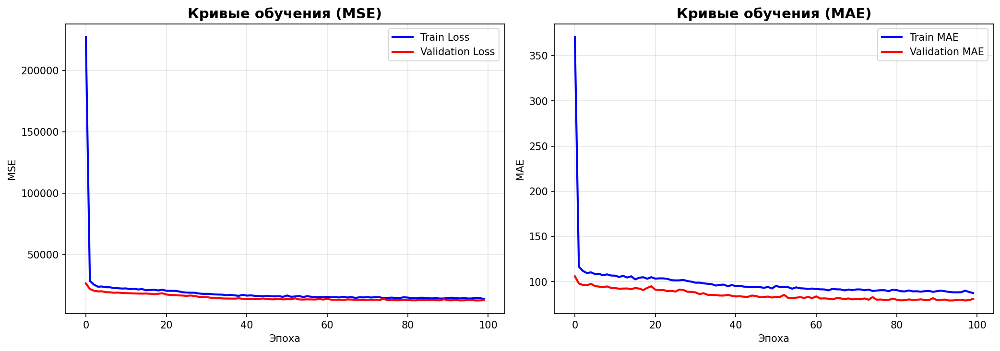

Значение ошибки на обучающей выборке быстро снижается в первые эпохи и постепенно стабилизируется. Значение ошибки на валидационной выборке достаточно близко к обучающей кривой, что указывает на хорошее обобщение модели.

**Гистограммы весов:**

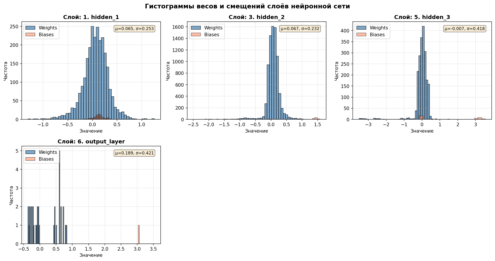
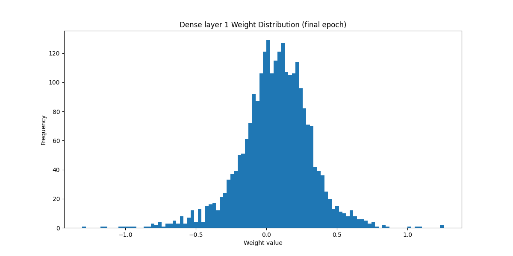
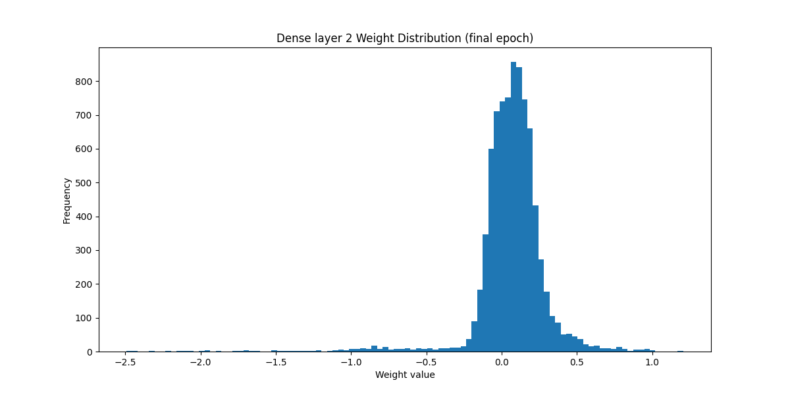
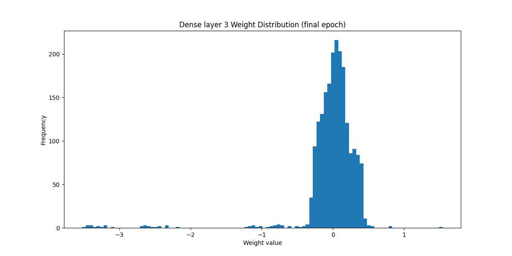
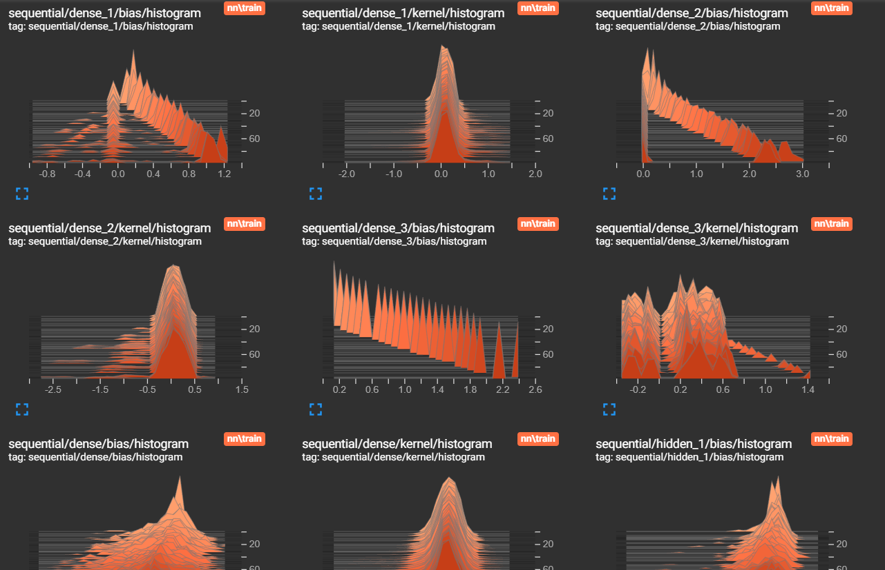

На графиках представлены распределения весов для каждого слоя:
- **Слой 1 (dense_1):** широкое распределение, так как нейроны обучаются разным признакам, сеть способна улавливать сложные зависимости
- **Слой 2 (dense_2):** пик ближе к 0, регуляризация и Dropout работают эффективно
- **Слой 3 (dense_3):** многие нейроны "выключаются", предотвращая переобучение

**Графики в TensorBoard**

```bash
tensorboard --logdir=logs
```
После выполнения `dvc repro` можно вывести все метрики с помощью следующей команды:

```bash
dvc metrics show
```


**Тренировочные метрики**

|Модели|                       MAE|           MSE|                R2|       RMSE|
|--|--|--|--|--|
|Линейная регрессия|  102.11051|     21572.0792|         0.64756|  146.87437|
|Дерево решений|      76.92482|      12004.01153|        0.80388|  109.56282|
|Catboost|           74.80437|      10723.85938|        0.82479|  103.55607|
|Xgboost|            62.35239|      7665.29118|         0.87476|  87.55165|
|Нейронная сеть|     101587.70263|  27012568729.45388|  0.79054|  164355.00823|


**Валидационные метрики**


|Модели|                       MAE|           MSE|                R2|       RMSE|
|--|--|--|--|--|
|Линейная регрессия|   104.3744|      22258.72578|        0.63895|  149.19358|
|Дерево решений|       85.64562    |  15353.16416    |    0.75097 | 123.90789|
|Catboost|             79.76243   |   12592.02655    |    0.79575 | 112.2142|
|Xgboost|              73.66152  |    11304.10345    |    0.81664 | 106.32076|
|Нейронная сеть|       79.18904   |   12779.0731     |    0.79272 | 113.04456|


**Тестовые метрики**


|Модели|                       MAE|           MSE|                R2|       RMSE|
|--|--|--|--|--|
|Линейная регрессия|  107.05539   |  24452.96655   |     0.60112 | 156.37444|
|Дерево решений|      80.65466  |    13586.68743   |     0.77837 | 116.56195|
|Catboost|            78.07604  |    11488.24844    |    0.8126  | 107.18325|
|Xgboost|             70.56583  |    10139.87036   |     0.8346 |  100.69692|
|Нейронная сеть|      76.86725  |    11319.27244   |     0.81536 | 106.39207|

---

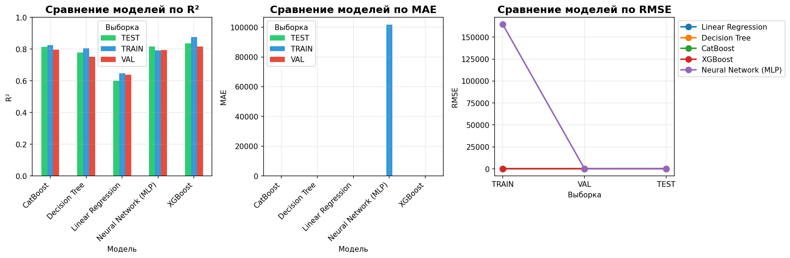

---
## Выводы по моделям

### Лучшая модель: **XGBoost**

**R² = 0.8346**

**MAE = 70.57**

**RMSE = 100.697**

Градиентный бустинг (XGBoost, CatBoost, нейросеть) значительно превосходит линейные модели.

**Наиболее важными признаками для предсказания цены автомобиля оказались:**

- car_age (возраст) — самый важный признак.

- max_power_num (мощность) — определяет цену.

- transmission_Automatic (автоматическая КПП) — повышает цену.

- fuel_Diesel (дизельное топливо) — повышает цену.

Категория бренда (премиум/массовые) также имеет значительное влияние.

Разница между train и test метриками минимальна (<5%), что указывает на отсутствие переобучения.


---

## Вычислительный граф DVC

Для вывода графа DVC необходимо использовать:
```bash
dvc dag
```

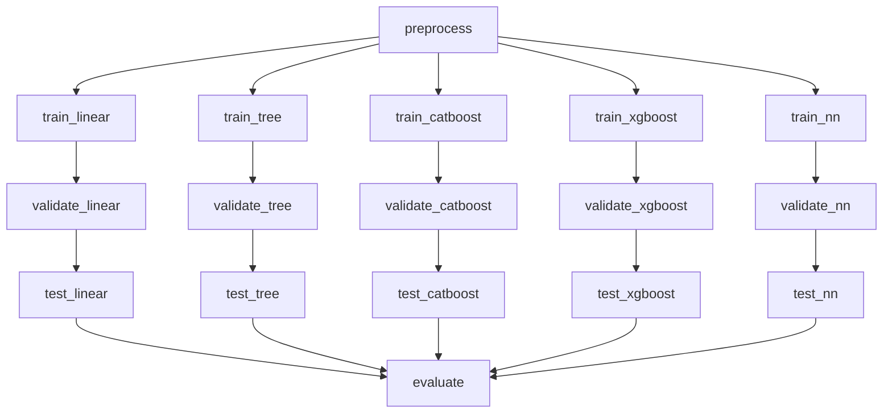
# Заключение

1. Проведён EDA с анализом корреляций, распределений и влияния признаков.

2. Целевая переменная преобразована с помощью sqrt для уменьшения асимметрии.

3. Из полных названий автомобилей были извлечены категории брендов и все категориальные признаки закодированы через OneHotEncoder.

4. Построен DVC-пайплайн с разделением на этапы предобработки, обучения, валидации и тестирования.

5. Реализованы и обучены 5 моделей машинного обучения:

    - Линейная регрессия;

    - Дерево решений;

    - CatBoost;

    - XGBoost;

    - Нейронная сеть.

Для всех моделей были сняты метрики, согласно которым лучшей моделью были выбрана **XGBoost** с R² = 0.8346 и наименьшими ошибками на тестовой выборке.

Подготовлены все необходимые визуализации:

- Тепловые карты корреляции;

- Коэффициенты линейной регрессии;

- Первые узлы дерева решений;

- Feature Importance для CatBoost и XGBoost;

- Кривые обучения и гистограммы весов для нейронной сети;

- Сводная таблица с метриками.

TensorBoard использован для мониторинга обучения нейронной сети.